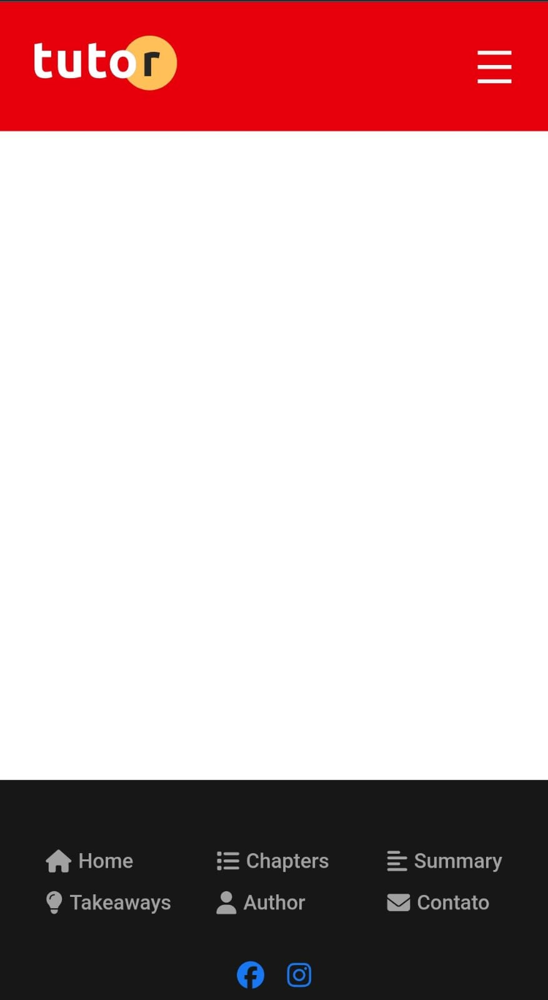

# Tutor -- Landing Page de Curso Online

Projeto de uma landing page responsiva para divulgação de um curso
online de criação de vídeos.\
Este projeto faz parte de um curso prático de HTML, CSS e JavaScript e
foi desenvolvido com foco em **boas práticas de estrutura, semântica,
responsividade e acessibilidade**.

## 🧠 O que este projeto demonstra

-   Estrutura semântica em HTML5\
-   Layout responsivo (desktop e mobile)\
-   Menu mobile com botão hambúrguer\
-   Uso de ícones com Font Awesome\
-   Boas práticas de acessibilidade (ARIA, navegação por teclado, foco)\
-   Organização de arquivos (CSS, JS, imagens)\
-   Construção de landing page realista para portfólio

## 🚀 Tecnologias utilizadas

-   HTML5\
-   CSS3 (Flexbox, responsividade)\
-   JavaScript (menu mobile e interações)\
-   Font Awesome (ícones)\
-   Google Fonts

## 📱 Responsividade

## Menu Mobile

O menu mobile é responsivo e funciona ao clicar no botão “hamburger”.  
Aqui está um exemplo com o menu aberto:

## 📱 Menu Mobile

O menu mobile é responsivo e funciona ao clicar no botão **hambúrguer**.  

**Menu Fechado:**  


**Menu Aberto:**  


O layout se adapta para diferentes tamanhos de tela, com: - Menu
tradicional no desktop\
- Menu hambúrguer no mobile\
- Ajustes visuais para melhor leitura em telas pequenas

## ♿ Acessibilidade

O projeto aplica conceitos básicos de acessibilidade, como: - Uso de
`aria-label` em links e botões\
- Navegação possível via teclado (Tab)\
- Estrutura semântica com `nav`, `header`, `section`, `footer`\
- Preocupação com foco visível para usuários que não usam mouse

## 📂 Estrutura de pastas

/ ├── index.html ├── contact.html ├── css/ │ └── styles.css ├── js/ │
└── script.js └── images/

## 🛠️ Como rodar o projeto

1.  Clone o repositório:

``` bash
git clone https://github.com/sanciweferson/web-tutor
```
 
2.  Abra o arquivo `index.html` no navegador\
    ou\
3.  Use uma extensão como Live Server no VS Code para melhor
    experiência.

## 🎯 Objetivo do projeto

Este projeto foi criado para: - Praticar fundamentos de HTML, CSS e
JavaScript\
- Treinar construção de layouts reais\
- Servir como peça de portfólio pessoal

## 📌 Observação

Este é um projeto educacional. O design é baseado em um layout de estudo
e foi implementado do zero para fins de aprendizado.

------------------------------------------------------------------------

Feito com foco em aprender a base da web antes de avançar para
frameworks 🚀
